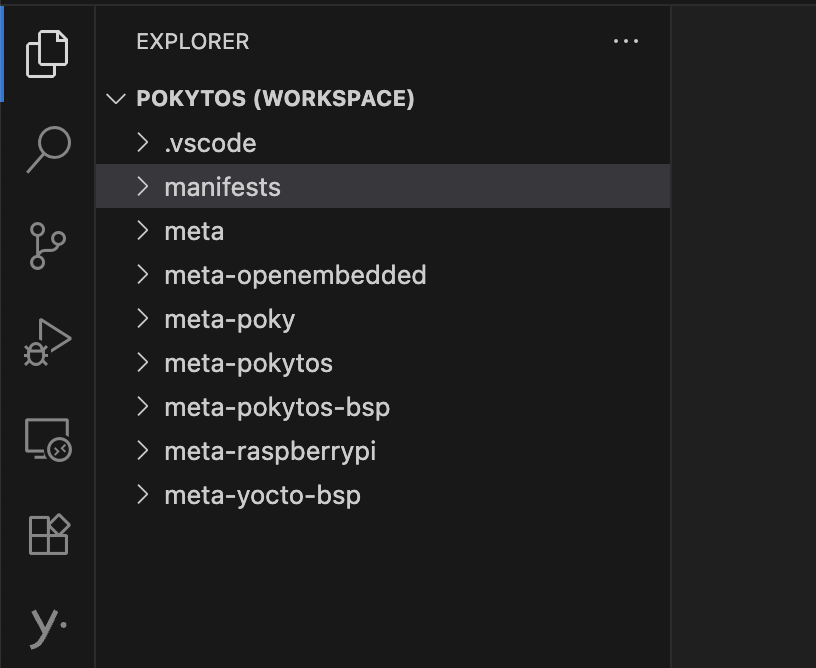

# Development Environment

## Index
1. [My setup](#my-setup)
2. [VSCode configuration](#vscode-configuration)

## My setup

* Headless (no GUI) Debian 12 (bookworm)
* Remotely logged in via ssh
* Run bitbake from a Docker container - [pokytos-builder](https://github.com/filhoDaMain/pokytos-builder/tree/main)
* VSCode as main Editor, remotely connected from my laptop to the Debian machine

## VSCode configuration

**VSCode Workspace** (for strict Yocto related development):
* pokytos-yocto/.vscode
* pokytos-yocto/.repo/manifests
* pokytos-yocto/meta
* pokytos-yocto/meta-openembedded
* pokytos-yocto/meta-poky
* pokytos-yocto/meta-pokytos
* pokytos-yocto/meta-pokytos-bsp
* pokytos-yocto/meta-raspberrypi
* pokytos-yocto/meta-yocto-bsp

 

VSCode Plugins:
* [Yocto Project BitBake](https://marketplace.visualstudio.com/items?itemName=yocto-project.yocto-bitbake)