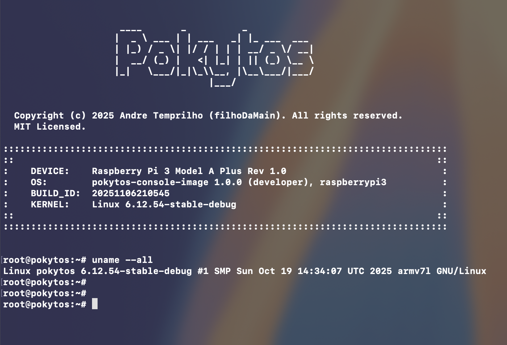

# Pokytos

**Pokytos** Yocto Distribution manifest repository



### Quick reference
**Cloning the project:**
```Bash
$ repo init -b scarthgap -m default.xml -u https://github.com/filhoDaMain/pokytos.git
$ repo sync
```
<br/>

**Building an image:**
> [!TIP]
> I recommend using a Docker image for this. <br/>
> Check my custom [pokytos-builder](https://github.com/filhoDaMain/pokytos-builder) set up for Yocto builds.

```Bash
$ cd pokytos
$ source pokytos-env
$ bitbake pokytos-console-image
```
<br/>

**Running an image on QEMU:**
```Bash
$ runqemu pokytos-console-image nographic slirp
```
<br/>

---
<br/>

# About Pokytos
**Pokytos** is a small Yocto "platform" that I started developing to store my customizations to build a Linux image suitable for Kernel hacking, learning and debugging.

The following devices are tested:

 
| MACHINE        | Device                       | Kernel                       |
| -------------- | ---------------------------- | ---------------------------- |
| raspi3ap       | Raspberry Pi 3 Model A Plus  | linux-stable (6.12 upstream) |
| opizero3       | Orange Pi Zero 3             | linux-stable (6.12 upstream) |
| qemu-raspi3ap  | QEMU virt platform           | linux-stable (6.12 upstream) |
| qemu-opizero3  | QEMU virt platform           | linux-stable (6.12 upstream) |

# How-tos
Have a look in the current [Pokytos Reference Manual](./Documentation/README.md).
